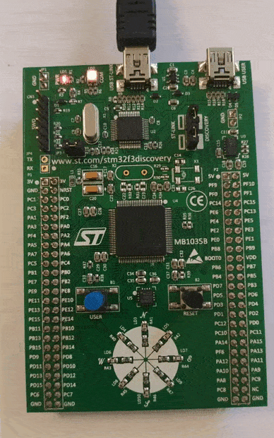

**Description**

*Home tasks are:*

• Create project to demonstrate static memory allocation. 
• Create project to demonstrate dynamic memory allocation. 
• Create function to check task stack overflow (for dynamic and static memory allocation). 

**Requirements**

Keil uVision v5.35.0.0 
STM32CubeMX v6.3.0 

**Task 1 notes**

In the program the use of static memory allocation for tasks is demonstrated. The first task switches on the 
LEDs on the board in series. The second task switches off the LEDs. The time delays used
in each task are sligthly different and it creates nice visual effect ('variable length caterpillar'). 

**Task 1 demonstration**
 

**Task 2 notes**

 * There are two tasks in the program. In the first task the data received from the UART is put into the queue.
 * In the second task the data read from the queue is used to control the LED states. As the commands the
 * characters from 'A' to 'H' are used to switch on one of eight LEDs on the board, and the characters
 * from 'a' to 'h' are used to switch off one of eight LEDs. USART2 is used in the program, so
 * it is necessary to use USB-RS232 converter (PA2 = TX, PA3 = RX; 9600 baud, 1 stop bit, 8 data bits, no parity). 

**Task 3 notes**

In the program two tasks are created. For one task the static memory allocation is used, for the other task
the dynamic memory allocation is used. In each task the recursive function for the factorial computation
is called. The argument of the factorial() function is being increased gradually and after that the functions for 
stack overflow check are called in each task. If it is detected that the task stack has been filled more than the half,
the task is deleted (removed from the RTOS kernels management) and two LEDs are switched on (green LEDs when half stack
overflow is detected for task 1, and blue LEDs when half stack overflow is detected for task 2). The stack sizes
for each task are different just to demonstrate that the stack overflow (strictly speaking half stack overflow
in this example) for both tasks occurs not simultaneously. Green blinking LEDs indicates
that the tasks are in the running mode. 

**Task 3 demonstration**
 

